

	<h1>Transaction Fraud Analysis Report</h1>

	

## Company Background
**GacelaPay** is a Mexico-based digital financial institution that provides payment and banking services to retail customers across Latin America and Europe, serving thousands of customers across these regions. Founded in 2018 and headquartered in Mexico City, the company has experienced rapid growth by offering a mobile-first experience focused on speed, accessibility, and low fees. It currently features over **50K** transactions.

GacelaPay's product ecosystem includes:
1. Debit accounts for everyday spending and transfers
1. Credit cards with integrated rewards programs
1. Crypto accounts that allow customers to buy, sell, and hold selected cryptocurrencies
1. Peer-to-peer and international transfers
1. Digital wallets and virtual cards for e-commerce transactions

Over the last few years, the company has been struggling with customer retention and increasing costs associated with incorrect fraud flagging, as they relied on legacy machine learning models and static thresholds that were not regularly recalibrated to evolving fraud patterns.

## Project overview

For the scope of this project, we will focus con transactions between the period of 2022 and 2025, since this has been the most underperforming range, largely due to the COVID-19 pandemic after-effects.

During these years, the company has processed **50,128** transactions, from which **977** have been confirmed to be fraudulent transactions, representing **1.95%** of total transactions.

Machine learning models analize transaction patterns over time and output a flag score that ranges between 0 and 1000, representing the probability that a given transaction is fraud. After that, the system compares this score with a fixed threshold of 700, meaning that every transaction with a score greater or equal to this threshold is flagged as fraud and blocked.

The following confusion matrix shows the flag results:

	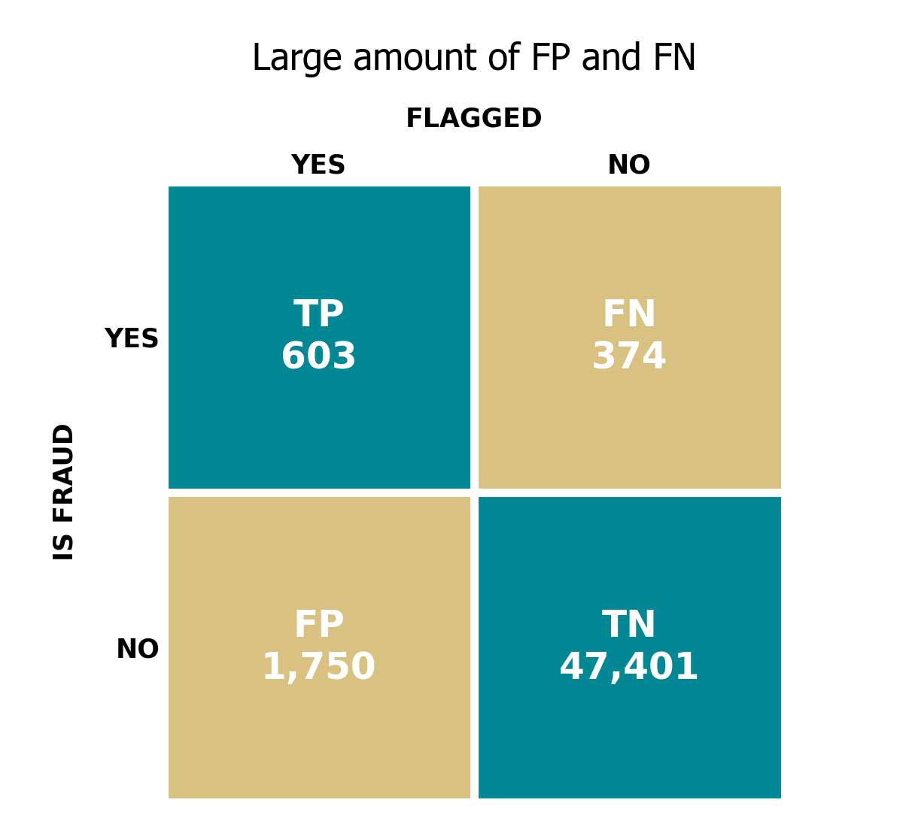

 

Given these values, the resulting core metrics arise:

| Metric | Value |
| --- | --- |
| False Positive Rate (FPR) | 3.56% |
| Fraud Detection Rate (FDR) | 61.72% |
| Precision | 25.63% |
| Accuracy | 95.76% |

Such high False Positive Rate coincides with customer churn rising over the years.

	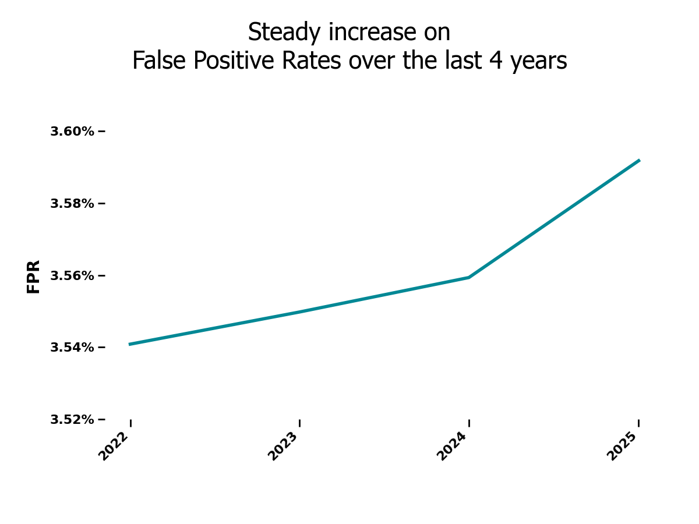

 

Aside from this, it's been reported that total costs associated with fraud activity and incorrect flaggings total over **$560K** dollars.

## Objective and Key Points (OKR)

Fraud Strategy and Financial department has made it clear that they need to meet the following goals:

### 1. Halve False Positive Rates by December 2026
### 2. Reduce Annual costs associated to fraud 25% by EOY 

## Stakeholder questions

### Fraud Strategy
1. What are the best fields we can use to increase system fraud detection?
1. Are there any helpful interactions between these fields?
1. Do we have to adjust the flagging threshold? if yes, which value should be used?
1. When a transaction seems to have high fraud probability, how should we scale up that probability?
1. What features and parameters are recommended to reduce FPR and total costs?

## Dataset Structure and ERD (Entity Relationship Diagram)

	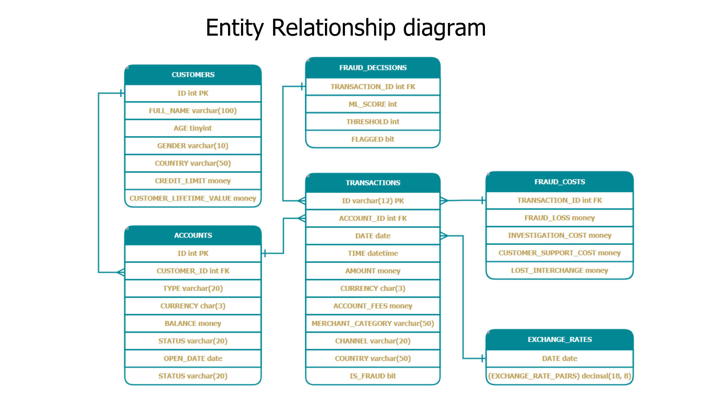

## Transaction field analysis

We will utilize **logistic regression** to adjust the Machine Learning Score and better adjust probability of fraud as this method always outputs a number from 0 and 1, so that the scales don't go outside the range of 0% and 100%.

First, we need to calculate the Information Value (IV) of each of the individual columns and interaction between 2 fields, so that we have a better understanding of what columns are better at catching fraud and use them to get valuable insights.

IV value Reference table:

| IV | Interpretation |
| --- | --- |
| <0.1 | Weak |
| 0.1 - 0.3 | Medium/useful|
| >0.3 | Strong |

 

	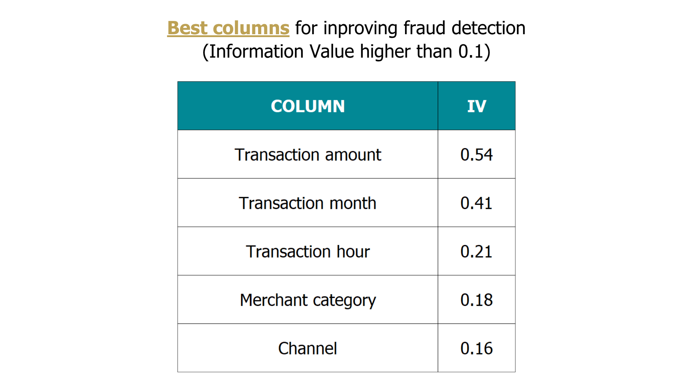

 
 

	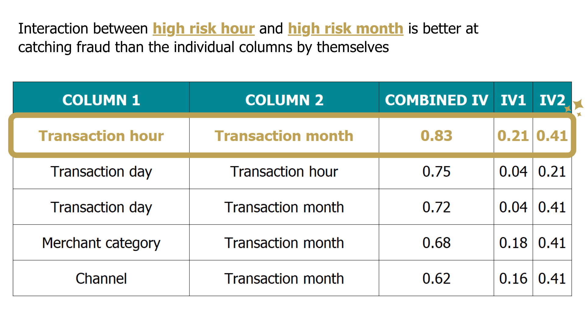

## Insights Deep-Dive

	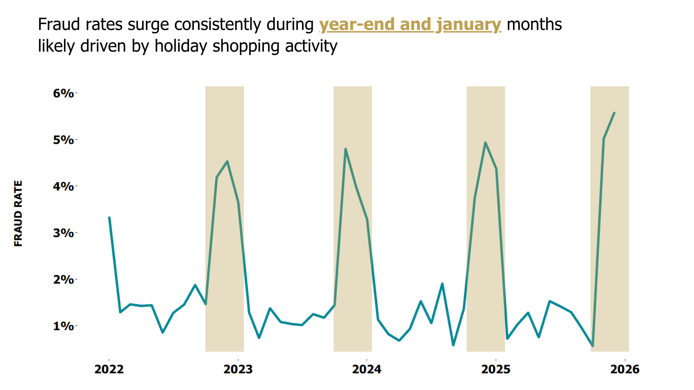

 

- November, december and january consistently register higher fraud post-pandemic with **fraud rates over 4%**.

- Special holidays during this season **(Black Friday, Chrismas, New Year, etc)** see an increase in sales and transaction volume, offering bigger opportunities for malicious entities to operate.

- WoE (Weight of Evidence) of transactions done between november and january is 0.8113, which increases the odds of these transactions of being fraud by **2.25x** more than the others.

 
 

	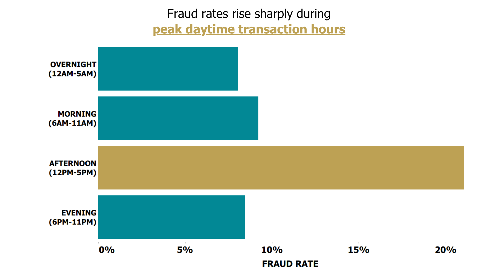

 

- More people make purchases during **lunch breaks and throughout the workday**, giving fraudsters more legitimate transactions to hide among.

- Transactions made in the afternoon look "ordinary". **A purchase at 2 PM is often less suspicious than one at 3 AM**.

- **Fraud rings often operate during standard working hours** when customer service teams, mule accounts, and collaborators are active and can respond quickly if issues arise.

- WoE: 0.6016, increasing odds by around **83%** of being fraud.

 
 

	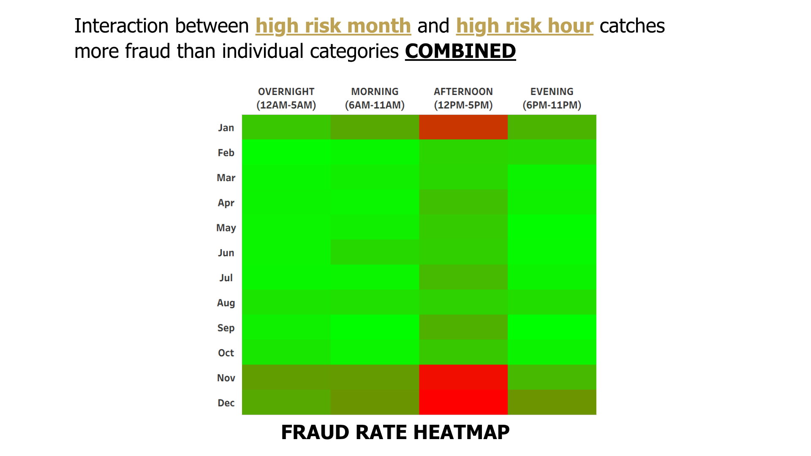

 

- Fraud detection can become more precise when 2 or more fields are present in a transaction. In this case, both fields being high risk, there is no surprise they increase fraud rates when combined.

- WoE: 1.4361, increasing odds by around **4.2x** of being fraud, working better than flagging individually.

 
 

	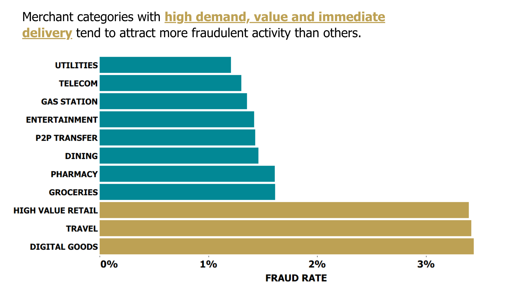

 

- Digital goods, such as gift cards, gaming credits, software licenses, and subscriptions are delivered immediately, giving fraudsters **little time to be stopped**.

- Flights, hotels, and vacation packages can generate **large profits** from a single successful fraud attempt, hence explaining why travel category exhibits these numbers.

- High value products such as smartphones, laptops, and designer goods can be **converted into cash** relatively easily.

- WoE: 0.5786, increasing odds by around **78%** of being fraud.

 
 

	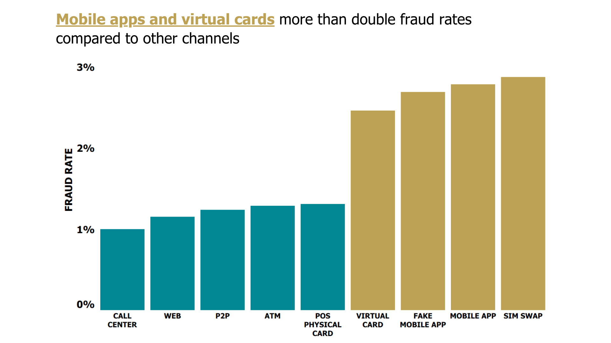

 

- Fraud rates increase as transactions move further away from physical possession and rely more heavily on digital identity.

- Traditional channels tend to have stronger friction and verification.

- Mobile app fraud is frequently linked to account takeover.

- WoE: 0.3398, increasing odds by **40%** of being fraud.

 
 

	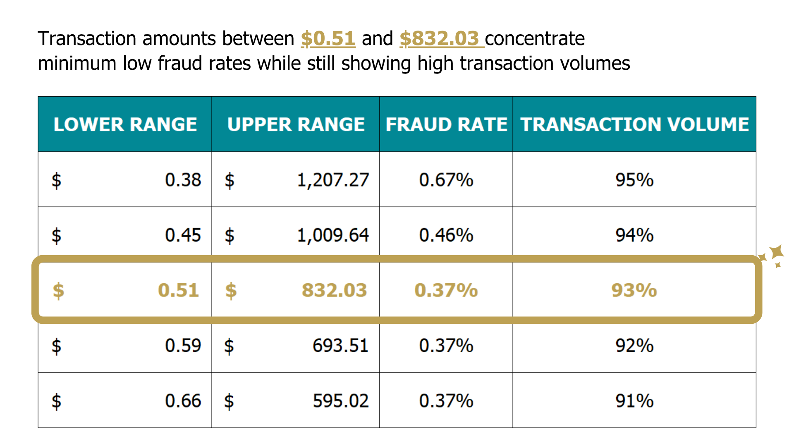

 

- Larger transactions are more attractive to fraudsters, as they are less common than the low value transactions.

- Since these transactions are more routinary, they concentrate higher volumne, but seems like malicious agents find higher amount transactions more than worth it.

- Risk often increases outside the normal spending band.

- WoE: -1.6775, reducing odds by **81%** of being fraud.

## Final results

After analysing these fields and having obtained the best logit values based on Weight of Evidence calculation, we can turn this information into conditional features that, when met by transactions, can increase or decrease its likelyhood of being fraud.

Now, the final step is to determine what should be the best threshold by which we consider a transaction legitimate or fraud. The focus is on reducing the False Positive Rates and total costs associated with fraud.

It's worth mentioning that:

<h3 style="padding: 10px; border-left: 5px solid #ffc107; text-align: center">
	Higher thresholds naturally decrease False Positive Rates, but may also increase False Negatives, which significantly increases costs, since failing to catch actual fraud reduces chances of recovering the funds, potentially incurring chargebacks of 100%+.
</h3>

 

The results are as shown:

	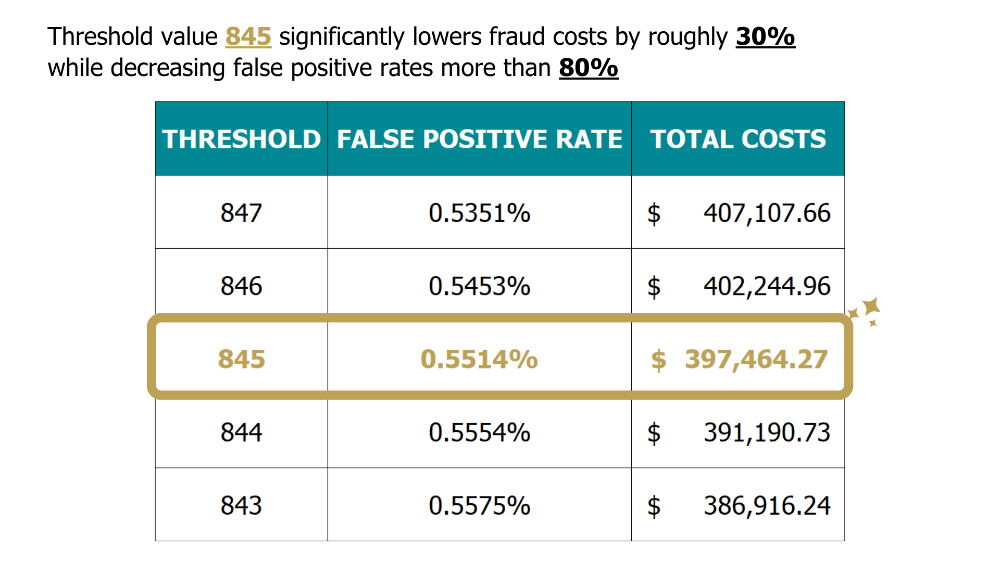

 

This threshold was carefully chosen as **reduces costs under $400k and fraud rates under 1%**.

 

<table>
	<tr>
		<td>
			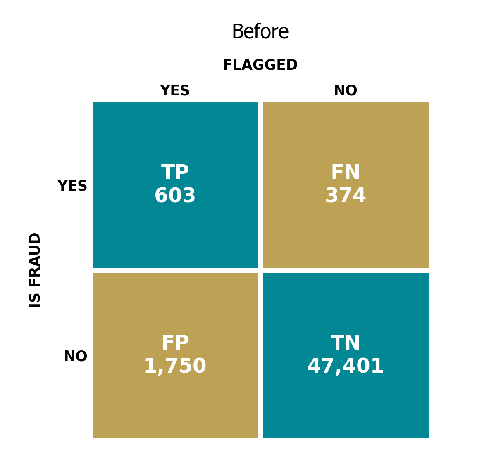
		</td>
		<td>
			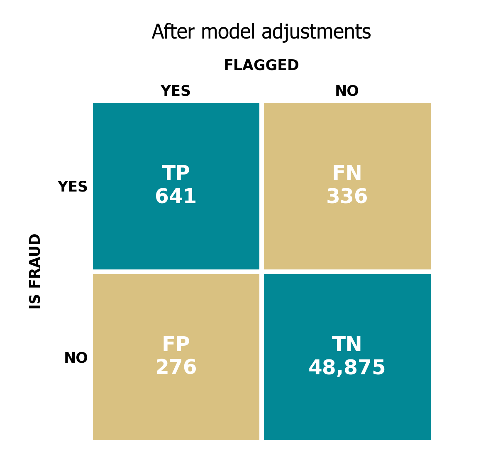
		</td>
	</tr>
</table>

 

	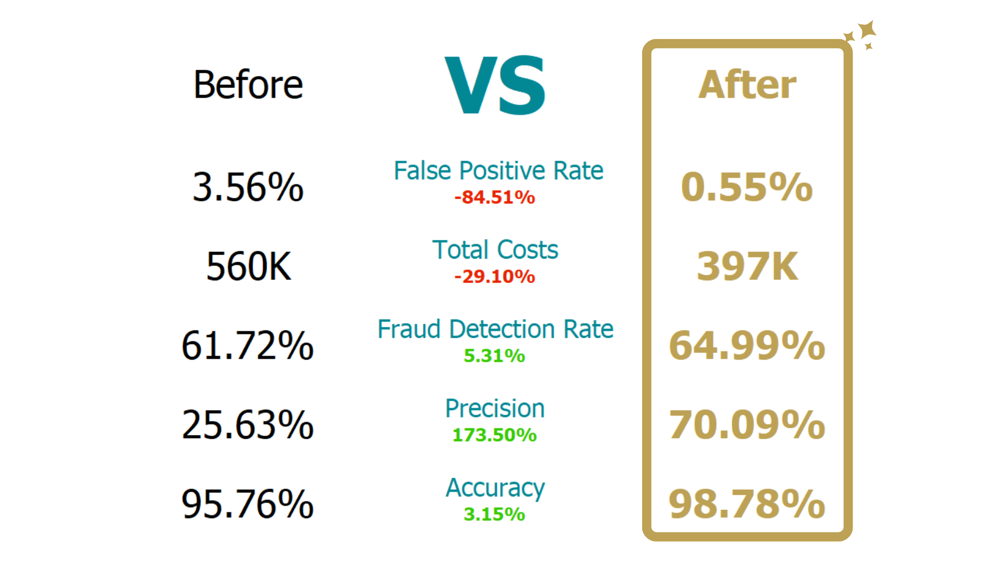

## Key Takeaways and Recommendations

For the Fraud Strategy department:

- Utilize Logistic regression as the main method for adjusting and testing fraud detection approaches.

- Key fields to pay most attention to: Transaction month, hour, merchant category, channel and transaction USD amount, as these columns offer higher precision and accuracy at flagging fraud activity.

- Use these logit values as reference for calibrating flagging rules:

| Columns | Conditions | Logit |
| --- | --- | --- |
| Transaction month | November, december and january months | 0.8113 |
| Transaction hour | Between 12pm and 5pm | 0.6016 |
| Month + hour | Risky month and risky hours as previously described | 1.4361 |
| Merchant category | High value retail, travel and digital goods | 0.5786 |
| Channel | Virtual card, fake mobile app, mobile app and SIM swap | 0.3398 |
| Transaction USD amount | Between $0.51 and $832.03 | -1.6775 |

<h3 style="padding: 10px; border-left: 5px solid #ffc107;">
	Note: Only use these parameters AS GENERAL REFERENCE, since these were ones that offered better results during testing.
</h3>

- Closely monitor main KPIs every month (FPR and total costs) and adjust parameters to effectively improve future results.
- Avoid overfitting with many features and conditions as this can harshly impact detection on future, frequent changing data.